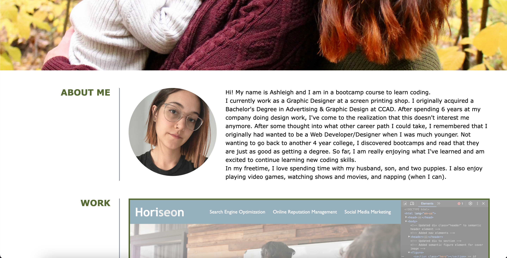
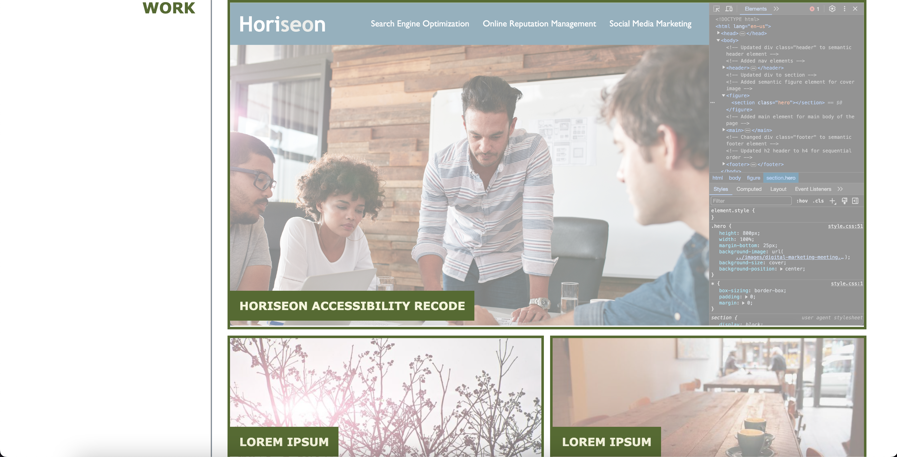
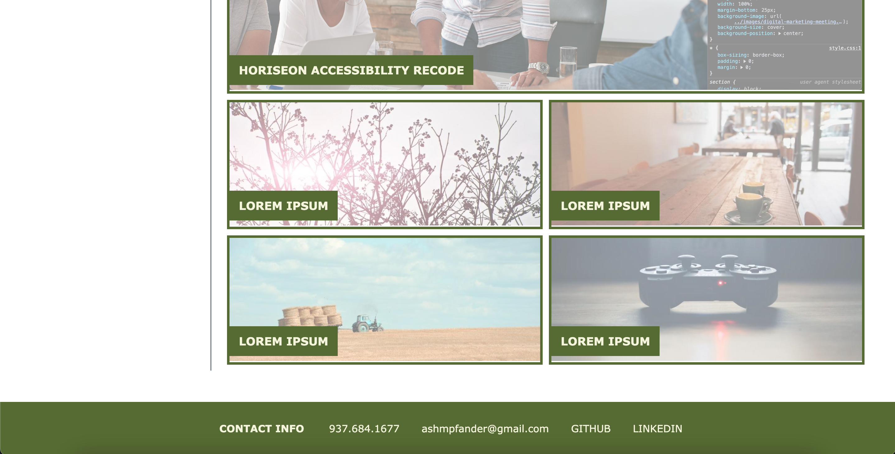

# 02 Module Challenge: Advanced CSS Portfolio

For this week's challenge, I had to create a portfolio page from scratch. Using HTML and CSS skills that I've learned thus far, I needed to meet certain criteria for this assignment. Using the demo gif provided for inspiration in functionality and layout, I was able to create this portfolio page. The following information was the criteria I needed to meet.

## User Story

```
AS AN employer
I WANT to view a potential employee's deployed portfolio of work samples
SO THAT I can review samples of their work and assess whether they're a good candidate for an open position
```

## Acceptance Criteria

```
GIVEN I need to sample a potential employee's previous work
WHEN I load their portfolio
THEN I am presented with the developer's name, a recent photo or avatar, and links to sections about them, their work, and how to contact them
WHEN I click one of the links in the navigation
THEN the UI scrolls to the corresponding section
WHEN I click on the link to the section about their work
THEN the UI scrolls to a section with titled images of the developer's applications
WHEN I am presented with the developer's first application
THEN that application's image should be larger in size than the others
WHEN I click on the images of the applications
THEN I am taken to that deployed application
WHEN I resize the page or view the site on various screens and devices
THEN I am presented with a responsive layout that adapts to my viewport
```

## Screenshots of Page






## Link to Deployed Application

https://ashpfander.github.io/ashleighs-web-portfolio/